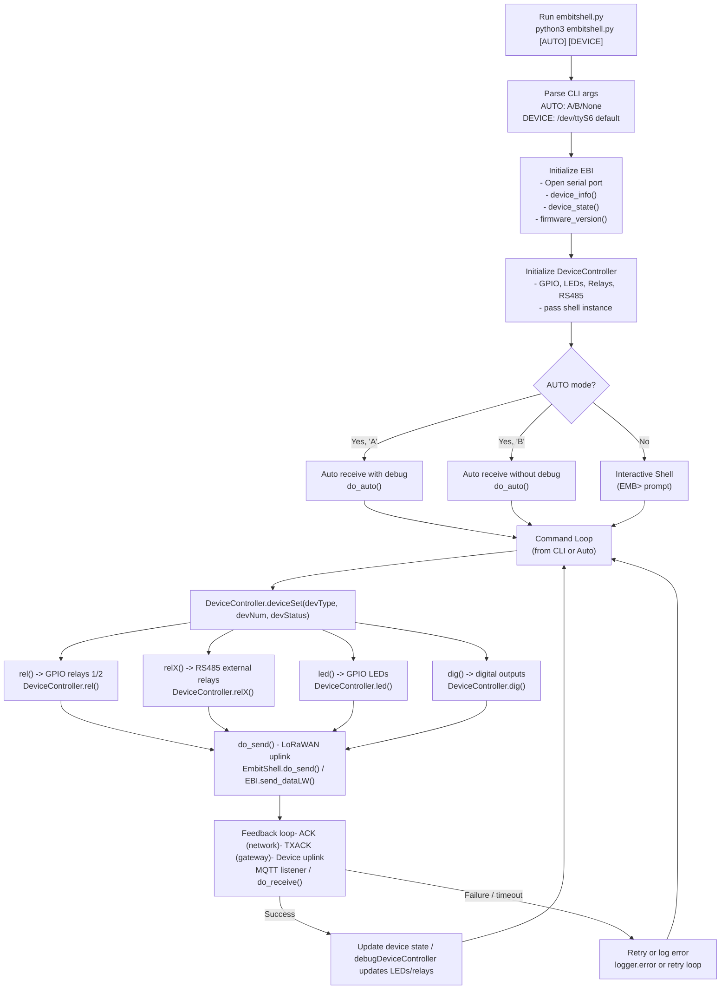

# EMBITShell Usage & Reference

## Command-Line Usage

```bash
python3 embitshell.py [AUTO] [DEVICE]
```
## EMBITShell CLI Arguments

| Argument | Description | Default / Notes |
|----------|-------------|----------------|
| AUTO     | Automatic continuous receive mode | `A` = auto receive with debug<br>`B` = auto receive without debug<br>`None` = interactive shell |
| DEVICE   | Serial port of the EMBIT module | `/dev/ttyS6` |

## Shell Commands (EMB>)

| Command    | Arguments        | Description |
|------------|-----------------|-------------|
| debug      | 0/1             | Enable/disable debug messages |
| state      | -               | Show current device state |
| reset      | -               | Reset the module |
| uart       | [value]         | Get/set serial UART speed |
| power      | [value]         | Get/set radio output power |
| channel    | [ch sf bw cr]   | Set or read LoRa channel parameters:<br>ch = channel<br>sf = spreading factor<br>bw = bandwidth<br>cr = coding rate |
| address    | [value]         | Set or read DevAddr |
| region     | [value]         | Set radio region |
| network    | [value]         | Set network ID |
| send       | payload [dest]  | Send a LoRaWAN packet (broadcast if no destination) |
| send_EMB   | payload [dest]  | Send a LoRaEMB packet (broadcast if no destination) |
| receive    | [protocol]      | Receive packet:<br>0 = LoRaWAN<br>1 = LoRaEMB |
| report     | -               | Print full device status & configuration report |
| default    | -               | Reset all settings to default |
| abp        | -               | Set LoRaWAN parameters manually (ABP, no auto join) |
| lorawan    | [class]         | Set LoRaWAN parameters with auto join class: 0, 1, 2 |
| app_key    | [value]         | Set AppKey |
| start      | -               | Start network |
| stop       | -               | Stop network |
| auto       | -               | Continuous receive mode (auto receive loop) |
| quit       | -               | Exit the shell |

## Examples:
```bash
python3 embitshell.py                # interactive shell
python3 embitshell.py A              # auto receive with debug
python3 embitshell.py B /dev/ttyS4   # auto receive without debug on /dev/ttyS4
```

## Block Diagram (Graphical Representation)



## Legend / Notes:
	•	CLI startup determines whether shell runs interactive or auto-receive mode.
	•	EBI init reads hardware state and firmware, preparing communication.
	•	DeviceController handles all hardware (GPIO, LEDs, relays, RS485).
	•	do_send() triggers LoRaWAN uplink feedback for each action.
	•	Feedback loop: ACK from network server, TXACK from gateway, and final uplink from remote device.
	•	Debug messages can be toggled per CLI option or shell command (debug 0|1).

## Flow explanation:
	1.	Commands (e.g., R:1:ON, X:3:OFF, L:R:ON) are passed to DeviceController.deviceSet().
	2.	deviceSet() dispatches to the correct method:
	•	rel() → local relays via GPIO
	•	relX() → RS485 external relays
	•	led() → RGB or status LEDs
	•	dig() → digital outputs
	3.	Each action also calls shell.do_send() to send LoRaWAN uplink feedback.
	4.	LoRaWAN uplink may trigger:
	•	ACK (received quickly from network server)
	•	TXACK (gateway confirms transmission)
	•	Device uplink (final confirmation from remote device)
	5.	Optional debug prints show status for each hardware action.

## WARNING
If embitshell.py is alredy active as a service:
systemctl status embitshell.service
is not possible to run manually another session because resources are busy