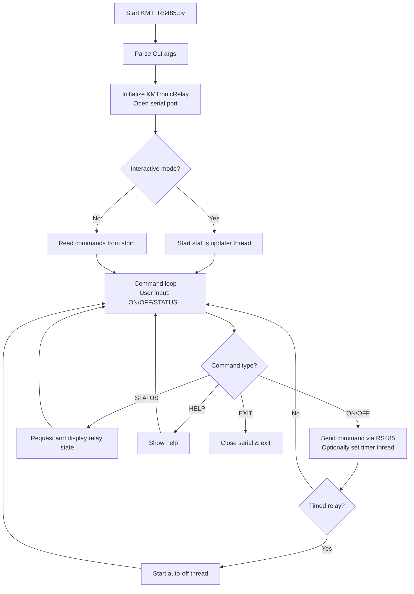

content = """# KMTronic RS485 Relay Controller

## Overview
`KMT_RS485.py` is a Python tool for controlling a **KMTronic RS485 relay board** with up to **8 channels**.  
It supports manual commands, timed relay operations (auto-off), and live status monitoring.

---

## Command-Line Usage

```bash
python3 KMT_RS485.py [OPTIONS]
```

### Options

| Argument        | Description                                     | Default      |
|-----------------|-------------------------------------------------|--------------|
| `--port`        | Serial port of the relay board                  | `/dev/ttyS4` |
| `--id`          | Board ID (1–255, for multi-device setups)       | `1`          |
| `--verbose`, `-v` | Print relay status after each command         | `False`      |
| `--nocolor`     | Disable colored output in terminal              | `False`      |
| `--compact`, `-c` | Compact output format (future use)            | `False`      |

---

## Interactive Shell Commands

When run in a terminal, the script enters **interactive shell mode**:

| Command   | Arguments                | Description |
|-----------|--------------------------|-------------|
| `ON <ch>` | One or more channels (`1-8` or `A`) | Turns ON selected relays |
| `ON <ch> -t <sec>` | Timed ON (auto OFF after N seconds) | Example: `ON 1 -t 5` turns channel 1 ON for 5s |
| `OFF <ch>` | One or more channels (`1-8` or `A`) | Turns OFF selected relays |
| `STATUS`  | –                        | Shows current status of all relays |
| `HELP`    | –                        | Displays command list |
| `EXIT`    | –                        | Exits the program |

---

## Relay Status Output

The relay states are displayed as:

- ✅ **ON** → Green  
- ❌ **OFF** → Red  
- ⚠️ **AUTO-OFF** (expired timer) → Yellow  

Example:

```
Relay> STATUS
1:ON 2:OFF 3:OFF 4:ON 5:OFF 6:OFF 7:OFF 8:OFF
```

---

## Auto Status Update

- When running interactively (`stdin` is a TTY), a background thread prints **relay status changes** every second.  
- If used in **pipeline mode** (`echo "ON 1" | python3 KMT_RS485.py`), the script processes commands from STDIN and exits when done.

---

## Internal Logic (Simplified Flow)



---

## Example Usages

Turn relay **1 ON** for 10 seconds:

```bash
python3 KMT_RS485.py --port /dev/ttyS4 --id 1
Relay> ON 1 -t 10
```

Turn **all relays OFF** via pipeline (non-interactive):

```bash
echo "OFF A" | python3 KMT_RS485.py --port /dev/ttyS4
```

Check **status only**:

```bash
echo "STATUS" | python3 KMT_RS485.py
```
"""
