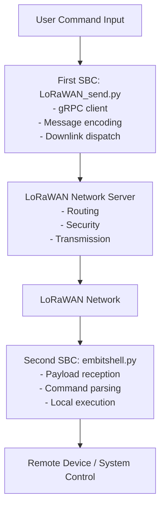
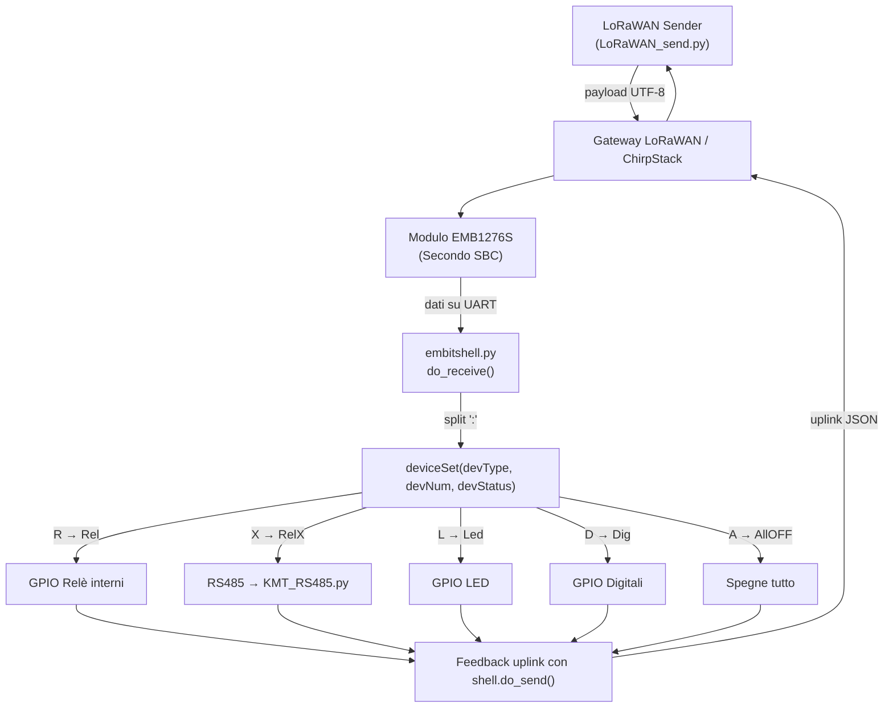

# LoRaWAN Remote Command System

This system enables remote control of devices over a LoRaWAN network using two Linux-based Single Board Computers (SBCs).  
Each SBC runs dedicated Python software, with one acting as the **command sender** and the other as the **command receiver and executor**.  

---

## System Overview

The architecture relies on a LoRaWAN Network Server (NS) as the intermediary.  

- **First SBC (Command sender):**  
  Runs [`LoRaWAN_send.py`](https://github.com/guiott/LoRaWAN_DownLink/blob/main/LoRaWAN_send.py), which connects to the NS via gRPC, prepares downlink frames, and schedules them for transmission.  

- **Second SBC (Command receiver/executor):**  
  Runs [`embitshell.py`](https://github.com/guiott/emb-python/blob/main/embitshell.py) as a background service, which receives downlink payloads, interprets them as shell-like commands, and executes them on the local system.  

This configuration allows high-level commands issued on one SBC to be executed remotely on another, with the LoRaWAN network providing long-range communication.  

---

## Software Components

### 1. Command Sender (First SBC)
- **Script:** `LoRaWAN_send.py`  
- **Functions:**  
  - Establishes a **gRPC connection** to the Network Server.  
  - **Encodes commands** into LoRaWAN-compliant downlink messages.  
  - **Schedules and dispatches** commands to remote nodes.  

### 2. Command Receiver/Executor (Second SBC)
- **Script:** `embitshell.py` (running as a system service).  
- **Functions:**  
  - **Listens for downlink messages** via the NS.  
  - **Parses payloads** into structured commands.  
  - **Executes commands** on the local Linux system.  
  - Provides an **extensible framework** to define new commands.  

---

## End-to-End Workflow

1. A user issues a command on the **first SBC**.  
2. `LoRaWAN_send.py` encodes the command and sends it via **gRPC** to the **LoRaWAN Network Server**.  
3. The Network Server handles **security, addressing, and transmission** over the LoRaWAN infrastructure.  
4. The **second SBC** receives the downlink message.  
5. `embitshell.py` interprets the payload and executes it locally.  
6. The command affects the **remote device/system** connected to the second SBC.  

---

## Block Diagram (Graphical Representation)

---

## Flusso dei comandi LoRaWAN → SBC → Attuatori

